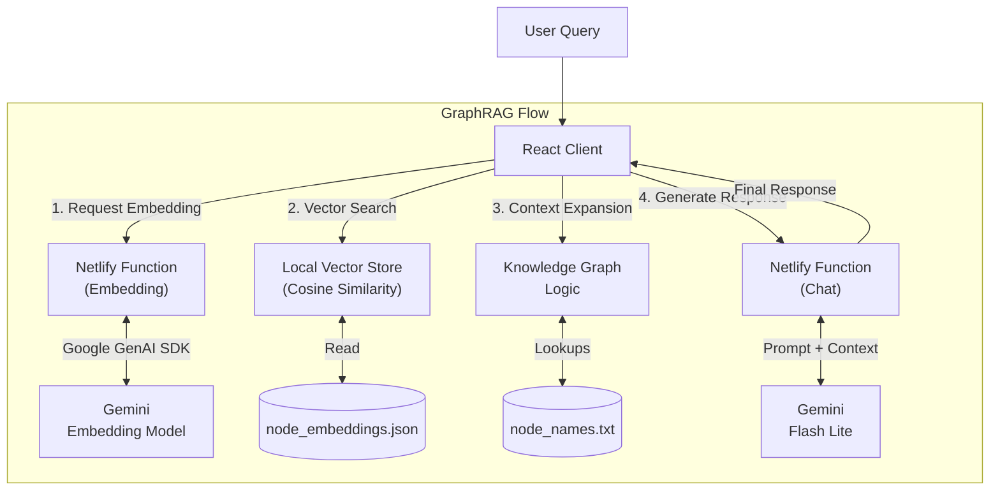

# Urban Education Explorer

**Live Demo**: [https://public-data-graph-rag.netlify.app/](https://public-data-graph-rag.netlify.app/)

### The Challenge
The Urban Institute provides a massive repository of educational data, yet its complexity often hinders accessibility.

-   **Extensive Data**

    3,000+ variables and 40+ endpoints from 25+ sources (IPEDS, College Scorecard).

-   **Comprehensive Coverage**

    Admissions, student outcomes, faculty, finance, safety, tax records, zip code, SES, and family income.

The challenge is that it's hard for people to know how to find what they are looking for. Navigating thousands of obscure variable codes (e.g., `cc_basic_2021`) requires extensive manual lookup, making it difficult to extract actionable insights.

### Our Approach

??? note "GraphRAG for Data Codes"
    Unlike standard AI chatbots that might hallucinate variable names, our system uses semantic vector search to map natural language queries directly to the authoritative variable codes in the database. When a user asks a question, the system retrieves the most relevant "codes" from the dataset documentation.

??? note "Knowledge Graph Context"
    These codes are not just retrieved as text; they are understood as nodes in a knowledge graph. The system identifies relationships—such as which directory a variable belongs to (e.g., IPEDS), its format (percentage, currency), and its entity type. This allows the AI to construct accurate, data-grounded answers.

??? note "Interactive Visualization"
    Beyond chat, we integrated a full feature suite including interactive **Leaflet maps** for geospatial analysis and rich data tables. Users can filter institutions by specific criteria and see the results instantly on a map, or switch to the "Applicants" view to analyze student demographics and application flows.

### Results & Impact
*   **Democratized Data Access**: Transformed a technical API documentation site into a conversational interface, allowing non-technical users to query the database using plain English.
*   **Accurate Code Retrieval**: The GraphRAG system successfully disambiguates between thousands of similar variable names, ensuring that the analysis is based on the correct underlying data fields.
*   **Unified Analysis Workflow**: users can move seamlessly from asking high-level questions in the Chat interface to deep-diving into specific schools in the Explorer view, with all complex data codes handled automatically in the background.

### Example Use

-   **Calculated Geomaps**

    

-   **Contextual Analysis**

    

-   **Generative Chat**

    

#### System Architecture

*Fig 1: The custom GraphRAG architecture combines serverless AI calls with client-side vector search for low-latency code retrieval.*

### Tech Stack
*   **Frontend**: React, TypeScript, Tailwind CSS
*   **AI & Logic**: Google Gemini (via Google Generative AI SDK), GraphRAG Architecture (Custom implementation with Vector Search + Knowledge Graph logic)
*   **Mapping**: Leaflet, React Leaflet
*   **Backend**: Netlify Functions (Serverless)
*   **Data Processing**: Client-side Vector Search (Cosine Similarity), Local JSON Data Stores